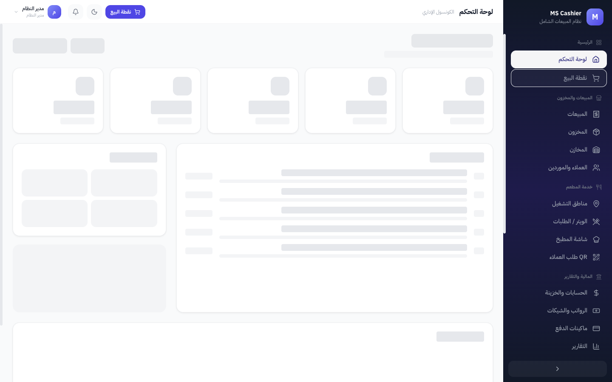
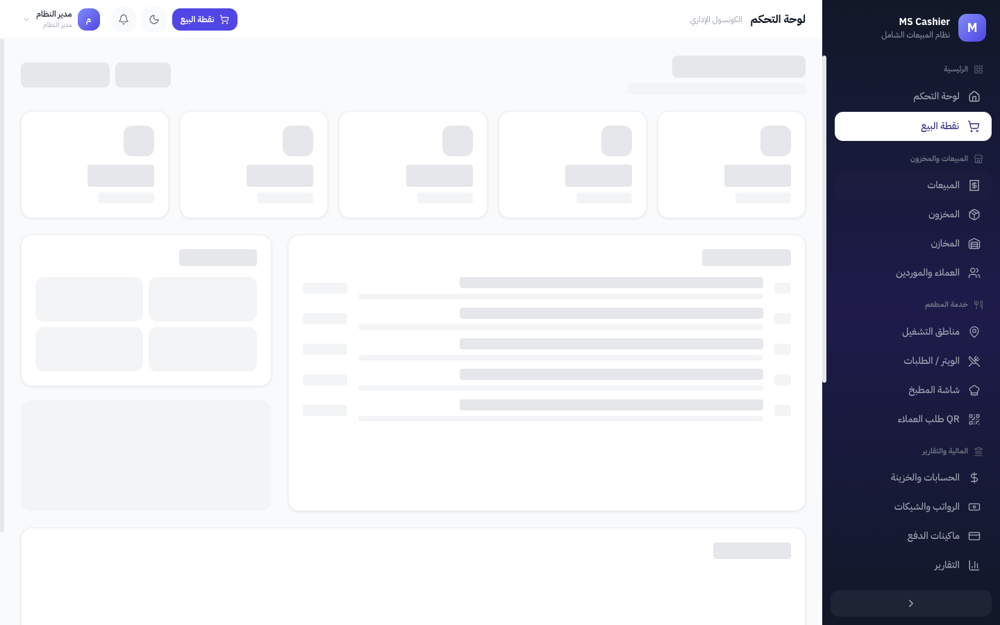
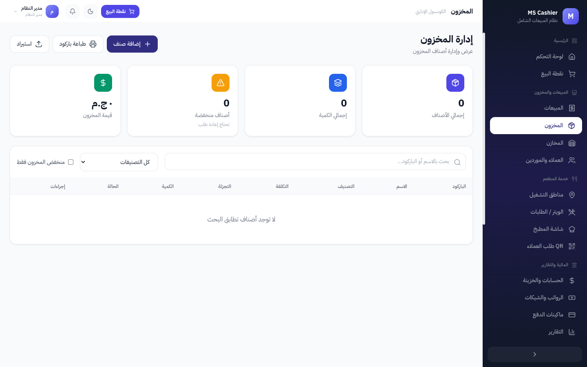
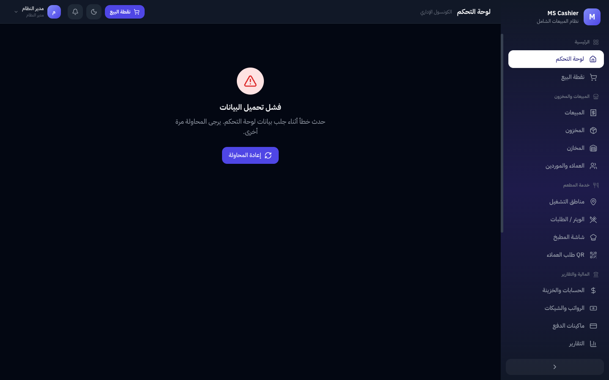
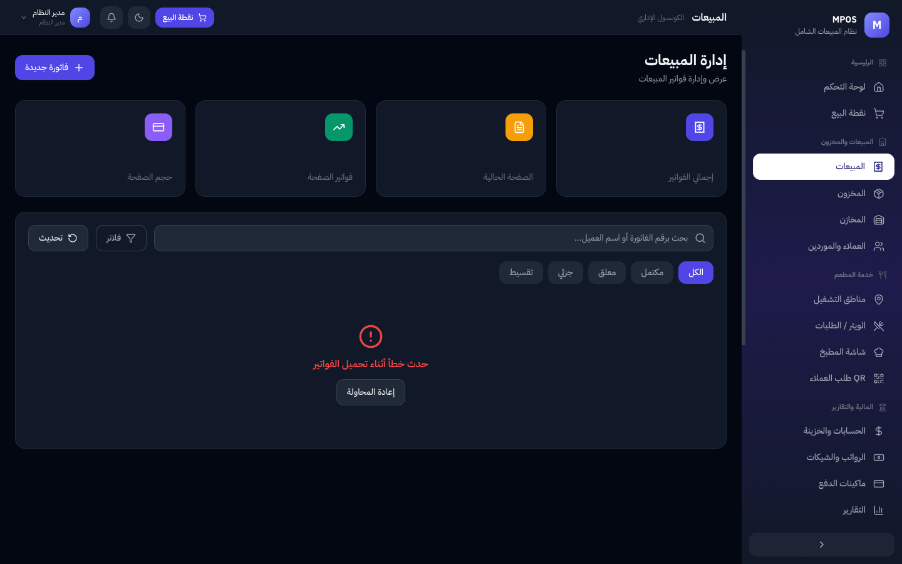
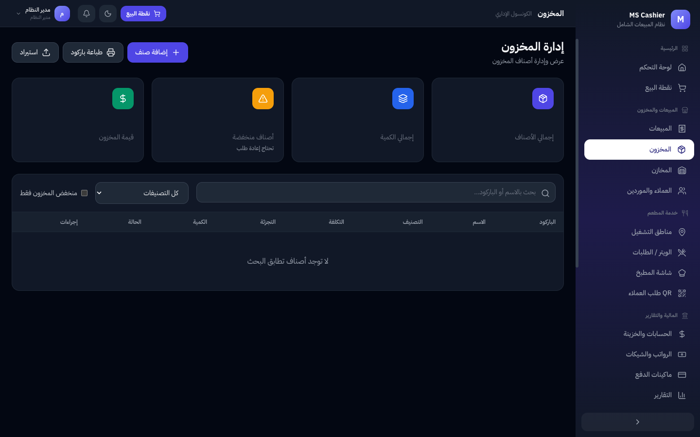
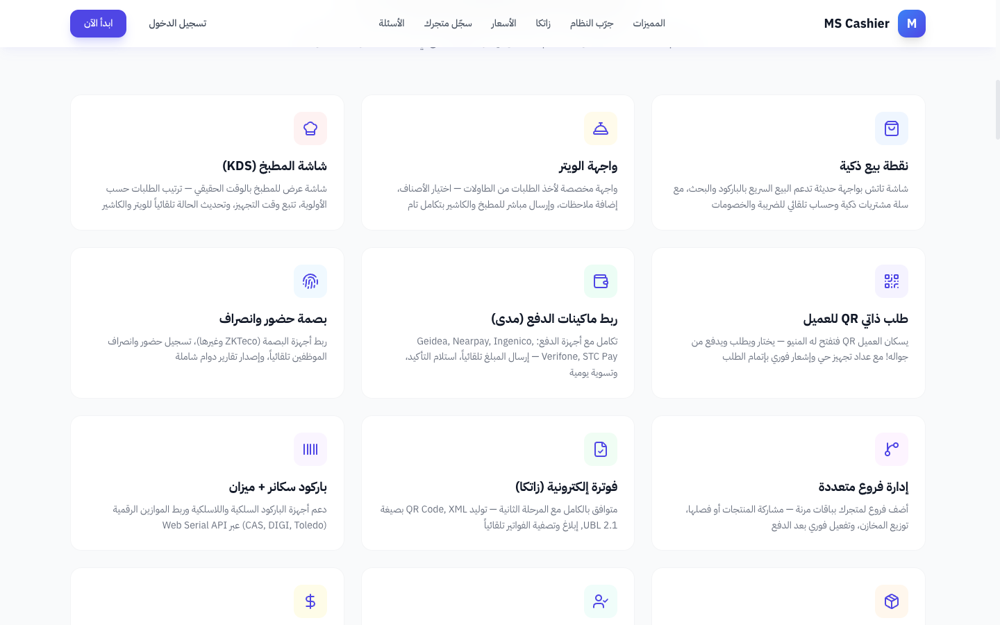

<div align="center">

# MPOS

### نظام نقاط البيع الأكثر تكاملاً في المملكة

نظام SaaS متعدد المستأجرين لإدارة المبيعات والمطاعم والفروع — مبني بـ **.NET 8 + React + SQL Server**

[](https://dotnet.microsoft.com/)
[](https://react.dev/)
[](https://www.typescriptlang.org/)
[](https://tailwindcss.com/)
[](https://www.microsoft.com/sql-server)
[](https://www.docker.com/)

</div>

---

<div align="center">


</div>

## المميزات

<table>
<tr>
<td width="50%">

### نقطة البيع (POS)
- شاشة تاتش بواجهة حديثة
- بيع سريع بالباركود والبحث
- حساب تلقائي للضريبة والخصومات
- يعمل أوفلاين مع مزامنة تلقائية

### إدارة المخزون
- مخازن متعددة (حتى 5 لكل متجر)
- تتبع الأصناف وتنبيهات النفاد
- نقل بين المخازن
- 4 مستويات أسعار لكل صنف

### المالية والخزينة
- حسابات متعددة (نقدي، بنكي، رقمي)
- تسجيل تلقائي للمعاملات
- تقارير مالية شاملة ولحظية

</td>
<td width="50%">

### خدمة المطعم
- واجهة ويتر مخصصة للطلبات
- شاشة مطبخ بالوقت الحقيقي (KDS)
- طلب ذاتي QR للعميل
- أقسام ومناطق تشغيل مرنة

### الموارد البشرية
- بصمة حضور وانصراف (ZKTeco)
- مسير رواتب شهري تلقائي
- إصدار شيكات رواتب

### الفوترة الإلكترونية (زاتكا)
- متوافق مع المرحلة الثانية
- QR Code + XML بصيغة UBL 2.1
- إبلاغ وتصفية الفواتير تلقائيًا

</td>
</tr>
</table>

## لقطات من النظام

### الوضع الفاتح (Light Mode)

<table>
<tr>
<td width="50%">

<p align="center"><em>لوحة التحكم</em></p>
</td>
<td width="50%">

<p align="center"><em>إدارة المبيعات</em></p>
</td>
</tr>
<tr>
<td width="50%">

<p align="center"><em>إدارة المخزون</em></p>
</td>
<td width="50%">

<p align="center"><em>تسجيل الدخول</em></p>
</td>
</tr>
</table>

### الوضع الداكن (Dark Mode)

<table>
<tr>
<td width="50%">

<p align="center"><em>لوحة التحكم</em></p>
</td>
<td width="50%">

<p align="center"><em>إدارة المبيعات</em></p>
</td>
</tr>
<tr>
<td colspan="2">

<p align="center"><em>إدارة المخزون</em></p>
</td>
</tr>
</table>

### صفحة الهبوط

<table>
<tr>
<td>

<p align="center"><em>المميزات والعرض التفاعلي</em></p>
</td>
</tr>
</table>

## هيكل المشروع

```
ms-cashier/
├── backend/
│   ├── MsCashier.Domain/           # الكيانات والعقود
│   ├── MsCashier.Application/      # منطق الأعمال (Services + DTOs)
│   ├── MsCashier.Infrastructure/   # قاعدة البيانات (EF Core + Repositories)
│   └── MsCashier.API/              # نقاط الوصول (12 Controller)
├── frontend/
│   ├── src/
│   │   ├── app/                    # App.tsx — التوجيه والتخطيط
│   │   ├── components/layout/      # Sidebar + Header
│   │   ├── features/               # 22 شاشة (Dashboard, POS, Inventory...)
│   │   ├── store/                  # Zustand (Auth, UI)
│   │   ├── lib/                    # API client, Permissions, Offline sync
│   │   └── styles/                 # Tailwind globals + Dark mode
│   └── tailwind.config.js
├── database/
│   └── 001-schema.sql              # سكيما قاعدة البيانات الكاملة
├── docker-compose.yml
└── Dockerfile
```

## الوحدات (22 شاشة)

| المجموعة | الشاشات | الوصف |
|----------|---------|-------|
| **الرئيسية** | لوحة التحكم، نقطة البيع | إحصائيات لحظية + كاشير مع باركود و4 طرق دفع |
| **المبيعات والمخزون** | المبيعات، المخزون، المخازن، العملاء | فواتير مع تقسيط ومرتجعات + أصناف مع 4 أسعار + مخازن متعددة |
| **خدمة المطعم** | مناطق التشغيل، الويتر، المطبخ، طلب QR | طاولات ومناطق + طلبات الويتر + شاشة المطبخ + طلب ذاتي |
| **المالية والتقارير** | الحسابات، الرواتب، ماكينات الدفع، التقارير | خزائن متعددة + مسير رواتب + ربط مدى + 8 أنواع تقارير |
| **شؤون الموظفين** | الموظفين، الحضور والانصراف | إدارة الموظفين + بصمة حضور وانصراف |
| **الإدارة** | الفروع، المستخدمين، الإعدادات | فروع متعددة + صلاحيات مفصّلة + إعدادات النظام |
| **إدارة النظام** | المتاجر، الاشتراكات، طلبات الفروع | إدارة مركزية للمستأجرين (SuperAdmin فقط) |

## نظام Multi-Tenant

```
┌─────────────┐     ┌──────────────────┐     ┌─────────────────────┐
│  JWT Token  │────>│ TenantMiddleware │────>│ Global Query Filter │
│ (tenant_id) │     │ (extract tenant) │     │ (auto-filter all)   │
└─────────────┘     └──────────────────┘     └─────────────────────┘
```

- **JWT Token** يحتوي على `tenant_id` لكل مستخدم
- **TenantMiddleware** يستخرج الـ tenant من كل request
- **Global Query Filters** في EF Core تفلتر كل الجداول تلقائيًا
- **SaveChanges Override** يضيف TenantId تلقائيًا لكل entity جديد

### خطط الاشتراك

| الخطة | السعر/شهر | المستخدمين | المخازن | نقاط البيع |
|-------|-----------|-----------|---------|-----------|
| أساسي | 1,400 ر.س | 3 | 1 | 1 |
| متقدم | 2,800 ر.س | 10 | 3 | 3 |
| احترافي | 4,200 ر.س | غير محدود | غير محدود | غير محدود |

## التقنيات

| الطبقة | التقنية |
|--------|---------|
| **Backend** | .NET 8 Web API, Clean Architecture, EF Core |
| **Frontend** | React 18, TypeScript 5, Tailwind CSS 3.4, Zustand, TanStack Query |
| **Database** | SQL Server 2022, Stored Procedures |
| **Auth** | JWT + Refresh Token, Role-based + Permission-based |
| **Cache** | Redis |
| **Queue** | RabbitMQ (أحداث موزعة) |
| **Offline** | IndexedDB + Service Worker + Auto Sync |
| **Container** | Docker + Docker Compose |
| **UI/UX** | RTL-first, Dark/Light Mode, Collapsible Grouped Sidebar |

## التشغيل

### باستخدام Docker

```bash
docker-compose up -d
# API: http://localhost:5000
# Frontend: http://localhost:5173
# Swagger: http://localhost:5000/swagger
```

### بدون Docker

```bash
# 1. Backend
cd backend/MsCashier.API
dotnet run

# 2. Frontend
cd frontend
npm install
npm run dev
```

### بيانات الدخول الافتراضية (Development)

| المستخدم | كلمة المرور | الدور |
|----------|-------------|-------|
| `admin` | `Admin@123` | SuperAdmin |

## API Endpoints

```
Auth:           POST /auth/login, /auth/refresh
Tenants:        CRUD /admin/tenants (Super Admin)
Products:       CRUD /products, GET /products/barcode/{code}
Categories:     CRUD /categories
Invoices:       POST /invoices/sale, /invoices/purchase, /invoices/{id}/return
Contacts:       CRUD /contacts, POST /contacts/{id}/payment
Warehouses:     CRUD /warehouses, POST /warehouses/transfer
Inventory:      GET /inventory/{warehouseId}, POST /inventory/adjust
Finance:        CRUD /finance/accounts, /finance/transactions
Employees:      CRUD /employees, POST /employees/{id}/attendance
Installments:   CRUD /installments, POST /installments/{id}/pay
Dashboard:      GET /dashboard
Reports:        GET /reports/sales, /profit, /inventory, /financial-summary
```

## قاعدة البيانات

### الجداول الرئيسية (20+ جدول)

- **Tenants** + **Plans** — إدارة المستأجرين والاشتراكات
- **Users** + **UserPermissions** — مستخدمين وصلاحيات مفصّلة
- **Products** + **Categories** + **Units** — الأصناف مع 4 أسعار بيع
- **Inventory** + **InventoryTransactions** — مخزون مع حركات كاملة
- **Warehouses** + **StockTransfers** — مخازن متعددة مع تحويلات
- **Invoices** + **InvoiceItems** — فواتير بيع ومشتريات ومرتجعات
- **Contacts** — عملاء وموردين مع أرصدة
- **Installments** + **InstallmentPayments** — نظام تقسيط
- **FinanceAccounts** + **FinanceTransactions** — خزائن ومعاملات مالية
- **Employees** + **Attendance** + **Payroll** — موظفين وحضور ورواتب
- **AuditLogs** — سجل مراجعة لكل العمليات

### Stored Procedures

- `sp_GetDashboardStats` — إحصائيات لوحة التحكم
- `sp_CreateSaleInvoice` — إنشاء فاتورة بيع مع تحديث المخزون والخزينة
- `sp_GetFinancialReport` — التقرير المالي الشامل

---

<div align="center">

**MPOS** &copy; 2026 — جميع الحقوق محفوظة

</div>
