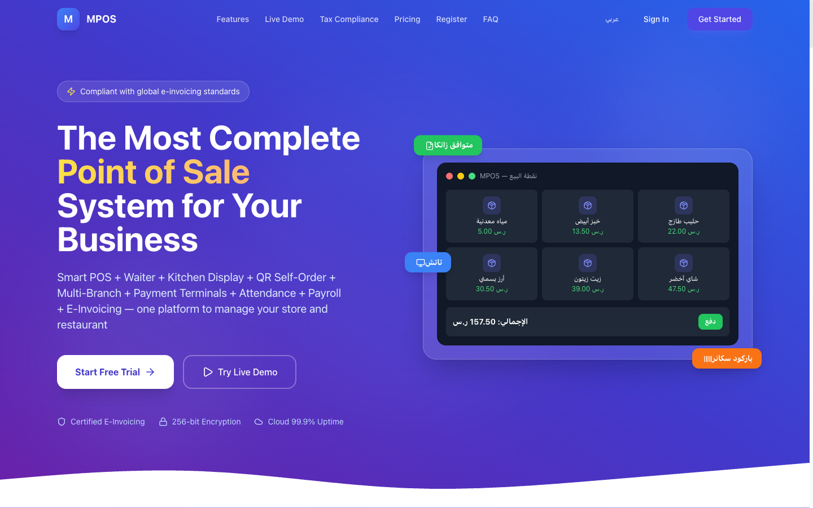
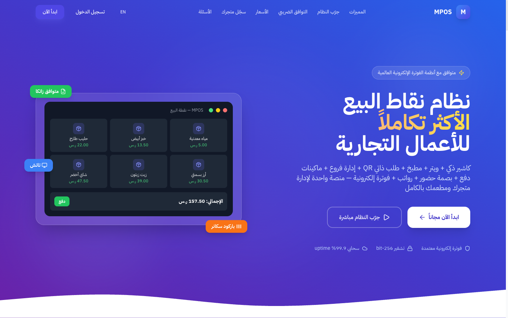
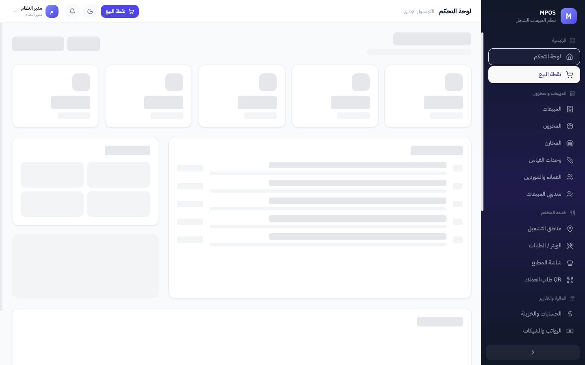
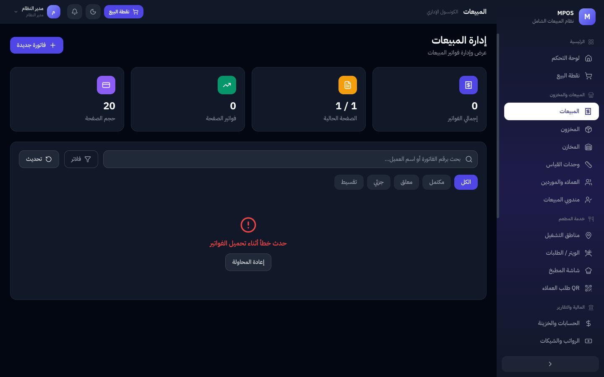
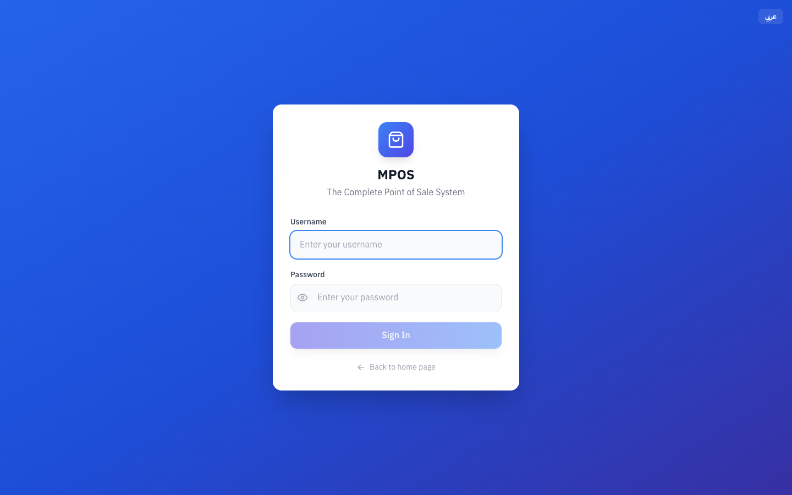
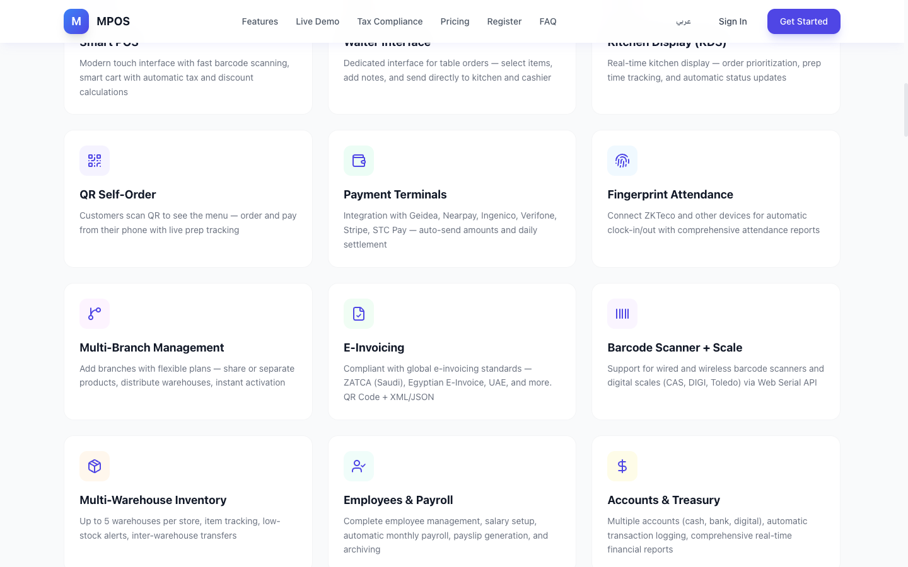

<div align="center">

# MPOS

### The Most Complete Point of Sale System for Your Business
### نظام نقاط البيع الأكثر تكاملاً للأعمال التجارية

A multi-tenant SaaS POS platform for retail, restaurants & multi-branch businesses — built with **.NET 8 + React 19 + SQL Server**

[](https://dotnet.microsoft.com/)
[](https://react.dev/)
[](https://www.typescriptlang.org/)
[](https://tailwindcss.com/)
[](https://www.microsoft.com/sql-server)
[](https://www.docker.com/)
[](.)

</div>

---

## Overview

MPOS is a production-ready, multi-tenant point-of-sale platform designed for retail stores, restaurants, and multi-branch businesses across the Middle East and beyond. It combines a smart POS terminal, online storefront, inventory management, restaurant operations, HR/payroll, and financial tracking into a single integrated system.

**Key stats:** 30+ screens | 48+ API controllers | 5 user roles | Full Arabic RTL support | Offline-capable PWA

---

## Screenshots

### Landing Page -- English (LTR) & Arabic (RTL)

<table>
<tr>
<td width="50%">

<p align="center"><em>English -- auto-detected from browser</em></p>
</td>
<td width="50%">

<p align="center"><em>Arabic -- RTL layout</em></p>
</td>
</tr>
</table>

### Admin Console -- Light & Dark Mode

<table>
<tr>
<td width="50%">

<p align="center"><em>Dashboard -- Light Mode</em></p>
</td>
<td width="50%">

<p align="center"><em>Dashboard -- Dark Mode</em></p>
</td>
</tr>
<tr>
<td width="50%">

<p align="center"><em>Sales Management -- Dark Mode</em></p>
</td>
<td width="50%">

<p align="center"><em>Login -- English</em></p>
</td>
</tr>
</table>

### Features Gallery

<table>
<tr>
<td>

<p align="center"><em>Feature overview -- Smart POS, Online Store, Waiter, Kitchen Display, QR Self-Order & more</em></p>
</td>
</tr>
</table>

---

## Features

### Core POS (نقطة البيع)

| Feature | Description |
|---------|-------------|
| Multi-device POS | Web-based terminal that runs on any device with a browser |
| 4-tier pricing | Retail, half-wholesale, wholesale, and custom price levels per product |
| Barcode scanning | Hardware barcode scanner + digital weight scale integration |
| Payment methods | Cash, card, bank transfer, credit accounts, and installment plans |
| Offline mode | Full offline operation with IndexedDB + Service Worker auto-sync |
| Item variants | Product variants by size, color, or any custom attribute |
| Customer-facing display | Secondary screen showing live order totals to the customer |
| Tax & discounts | Automatic tax calculation with per-item and per-invoice discounts |

### Online Store (المتجر الإلكتروني) -- NEW

| Feature | Description |
|---------|-------------|
| Per-tenant storefront | Each tenant gets their own e-commerce store |
| Custom domains | Subdomain included + custom domain support |
| Design themes | Multiple storefront design themes to choose from |
| Inventory integration | Full sync with POS inventory -- stock updates in real time |
| Order-to-POS | Online orders flow directly into POS with auto-print |
| Payment gateways | Stripe, PayTabs, Tap, Moyasar, Fawry (5 gateways) |
| Shipping config | Flexible shipping zones, rates, and delivery options |

### Inventory Management (ادارة المخزون)

| Feature | Description |
|---------|-------------|
| Real-time tracking | Live stock levels with configurable low-stock alerts |
| Multi-warehouse | Up to 5 warehouses per store with inter-warehouse transfers |
| Units & conversions | Define units (piece, box, carton) with automatic conversion ratios |
| Recipes & production | Recipe management with production orders and food cost tracking |
| Production waste | Track and report on production waste |
| CSV import/export | Bulk product import and inventory export via CSV |
| RFID inventory counting | RFID + QR code support for fast physical inventory counts |

### Restaurant (ادارة المطاعم)

| Feature | Description |
|---------|-------------|
| Floor plan | Visual floor layout with zones (indoor, outdoor, VIP, bar) |
| Table management | Table status tracking, merging, and splitting |
| Waiter system | Dedicated waiter interface for table-side ordering |
| Kitchen Display (KDS) | Real-time kitchen display with multiple station support |
| QR self-ordering | Customers scan a QR code to browse the menu and place orders |
| Dine-in orders | Full dine-in order lifecycle from seating to checkout |

### HR & Finance (الموارد البشرية والمالية)

| Feature | Description |
|---------|-------------|
| Payroll | Automatic monthly payroll with salary configuration |
| Attendance | Fingerprint attendance via ZKTeco biometric devices |
| Employee management | Employee profiles, contracts, and payslip generation |
| Financial accounts | Multi-account treasury (cash, bank, digital wallets) |
| Income/expense | Transaction logging with categorization and reporting |
| ZATCA e-invoicing | Saudi Arabia Phase 2 compliant electronic invoicing |
| Sales reps | Sales representative management with commission tracking |
| Installments | Customer installment plans with payment tracking |

### Marketing & Loyalty (التسويق والولاء) -- NEW

| Feature | Description |
|---------|-------------|
| Loyalty points | Configurable points program -- earn on purchases, redeem for discounts |
| Social media integration | Connect social accounts with auto-posting capabilities |
| Real-time notifications | Push notifications for orders, low stock, and system events |

### Developer Tools (ادوات المطورين) -- NEW

| Feature | Description |
|---------|-------------|
| Public REST API | Documented API with key-based authentication for third-party integrations |
| Webhook system | 15+ event types -- subscribe to order, inventory, and payment events |
| OAuth 2.0 ready | Standard OAuth 2.0 flow for secure third-party access |
| API management | Dashboard to manage API keys, monitor usage, and configure webhooks |

### Technical & Platform

| Feature | Description |
|---------|-------------|
| PWA | Installable Progressive Web App with offline support |
| Full RTL support | Complete Arabic RTL layout with auto-detection from browser locale |
| Dark mode | System-wide dark/light toggle with persistent preference |
| Multi-tenant | Complete data isolation between stores with centralized admin |
| Role-based access | 5 roles (SuperAdmin, Admin, Manager, Cashier, Waiter) with granular permissions |
| Grouped sidebar | 7 collapsible navigation groups with smooth animation |
| OTP authentication | One-time password support for secure login |

---

## Tech Stack

| Layer | Technology |
|-------|------------|
| **Backend** | .NET 8 Web API, Clean Architecture (Domain / Application / Infrastructure / API) |
| **Frontend** | React 19, TypeScript 5, Tailwind CSS 3.4, TanStack Query, Zustand |
| **Database** | SQL Server 2022 with EF Core, Migrations, Stored Procedures |
| **Auth** | JWT + Refresh Tokens, Role-based + Permission-based access control |
| **i18n** | Custom Zustand-based system with auto-detect (Arabic / English) |
| **Theming** | Dark/Light with CSS class strategy + Zustand persist |
| **Cache** | Redis |
| **Queue** | RabbitMQ (distributed events) |
| **Offline** | IndexedDB + Service Worker + Auto Sync |
| **Container** | Docker + Docker Compose |

---

## Getting Started

### Docker (Recommended)

```bash
docker-compose up -d
# API:      http://localhost:5000
# Frontend: http://localhost:5173
# Swagger:  http://localhost:5000/swagger
```

### Manual Setup

```bash
# 1. Backend
cd backend/MsCashier.API
dotnet run

# 2. Frontend
cd frontend
npm install
npm run dev
```

### Default Credentials (Development)

| Username | Password | Role |
|----------|----------|------|
| `admin` | `Admin@123` | SuperAdmin |

---

## Project Structure

```
mpos/
├── backend/
│   ├── MsCashier.Domain/           # Entities & domain contracts
│   ├── MsCashier.Application/      # Business logic, Services, DTOs
│   ├── MsCashier.Infrastructure/   # EF Core, Repositories, Migrations
│   └── MsCashier.API/              # REST API (48 Controllers)
│       ├── Controllers/
│       │   ├── AuthController          # JWT login, refresh, OTP
│       │   ├── ProductsController      # CRUD + barcode lookup + variants
│       │   ├── InvoicesController      # Sales, purchases, returns
│       │   ├── OnlineStoreController   # Storefront config & themes
│       │   ├── StorefrontController    # Public-facing store API
│       │   ├── LoyaltyController       # Points program
│       │   ├── SocialMediaController   # Social integration
│       │   ├── PublicApiManagement...  # API keys & webhooks
│       │   ├── RfidInventoryController # RFID counting
│       │   ├── ZatcaController         # Saudi e-invoicing
│       │   └── ...                     # 38 more controllers
│       └── Program.cs
├── frontend/
│   ├── src/
│   │   ├── app/                    # App.tsx — routing & layout
│   │   ├── components/
│   │   │   ├── layout/             # Sidebar (grouped) + Header (theme toggle)
│   │   │   └── ui/                 # Shared UI components
│   │   ├── features/               # 30+ feature modules
│   │   │   ├── pos/                # POS terminal
│   │   │   ├── online-store/       # Online store management
│   │   │   ├── inventory/          # Stock management
│   │   │   ├── loyalty/            # Loyalty program
│   │   │   ├── social-media/       # Social integration
│   │   │   ├── api-management/     # Developer API dashboard
│   │   │   ├── rfid-inventory/     # RFID counting
│   │   │   ├── floor/              # Restaurant floor plan
│   │   │   ├── waiter/             # Waiter interface
│   │   │   ├── customer-display/   # Customer-facing screen
│   │   │   └── ...                 # 20+ more modules
│   │   ├── store/                  # Zustand (Auth, UI with persist)
│   │   ├── lib/
│   │   │   ├── i18n/               # AR + EN translations
│   │   │   ├── permissions/        # Role + Permission system
│   │   │   ├── offline/            # IndexedDB + Service Worker sync
│   │   │   └── api/                # API client + endpoints
│   │   ├── hooks/                  # Custom React hooks
│   │   ├── types/                  # TypeScript types
│   │   └── styles/                 # Tailwind globals + Dark mode
│   └── tailwind.config.js
├── database/
│   └── 001-schema.sql              # Full database schema
├── docker-compose.yml
└── Dockerfile
```

---

## Modules (30+ Screens)

| Group | Screens | Description |
|-------|---------|-------------|
| **Main** | Dashboard, POS, Customer Display | Real-time analytics + smart cashier + customer-facing screen |
| **Online Store** | Store Settings, Storefront, Payment Gateways | Per-tenant e-commerce with themes and 5 payment gateways |
| **Sales & Inventory** | Sales, Inventory, Warehouses, Units, Customers, Sales Reps | Invoices, returns, installments + multi-warehouse stock |
| **Production** | Recipes, Production Orders, Production Waste | Recipe-based manufacturing with cost tracking |
| **Restaurant** | Floor Plan, Tables, Waiter, Kitchen Stations, QR Orders, Dine Orders | Full restaurant operations from floor to kitchen |
| **Finance & Reports** | Accounts, Payroll, Payment Terminals, Reports | Treasury, payroll, device integration, 8+ report types |
| **HR** | Employees, Attendance, Salary Config | Employee management + ZKTeco biometric attendance |
| **Marketing** | Loyalty, Social Media, Notifications | Points program + social auto-posting + real-time alerts |
| **Developer** | API Management, Integrations | Public API keys, webhooks, OAuth config |
| **Admin** | Branches, Users, Settings, RFID Inventory | Multi-branch + permissions + RFID stock counting |
| **System** | Tenants, Subscriptions, Branch Requests | Multi-tenant admin (SuperAdmin only) |

---

## Multi-Tenant Architecture

```
┌─────────────┐     ┌──────────────────┐     ┌─────────────────────┐
│  JWT Token  │────>│ TenantMiddleware │────>│ Global Query Filter │
│ (tenant_id) │     │ (extract tenant) │     │ (auto-filter all)   │
└─────────────┘     └──────────────────┘     └─────────────────────┘
```

- **JWT Token** contains `tenant_id` per user
- **TenantMiddleware** extracts tenant context from every request
- **Global Query Filters** in EF Core auto-scope all queries to the current tenant
- **SaveChanges Override** auto-assigns TenantId to new entities

---

## API Reference

The API exposes 48 controllers organized by domain. Key endpoints:

```
Auth            POST /auth/login, /auth/refresh, /auth/otp
Tenants         CRUD /admin/tenants (SuperAdmin)
Products        CRUD /products, GET /products/barcode/{code}
Product Variants CRUD /product-variants
Categories      CRUD /categories
Units           CRUD /units
Invoices        POST /invoices/sale, /invoices/purchase, /invoices/{id}/return
Contacts        CRUD /contacts, POST /contacts/{id}/payment
Sales Reps      CRUD /sales-reps, GET /sales-reps/{id}/commissions
Warehouses      CRUD /warehouses, POST /warehouses/transfer
Inventory       GET /inventory/{warehouseId}, POST /inventory/adjust
RFID Inventory  POST /rfid-inventory/count, /rfid-inventory/reconcile
Finance         CRUD /finance/accounts, /finance/transactions
Employees       CRUD /employees, POST /employees/{id}/attendance
Payroll         GET /payroll, POST /payroll/generate
Installments    CRUD /installments, POST /installments/{id}/pay
Dashboard       GET /dashboard
Reports         GET /reports/sales, /profit, /inventory, /financial-summary
Recipes         CRUD /recipes, POST /recipes/{id}/produce
Online Store    CRUD /online-store/settings, /online-store/themes
Storefront      GET /storefront/{slug} (public)
Payment Gateway CRUD /payment-gateways
Loyalty         GET /loyalty/points, POST /loyalty/redeem
Social Media    CRUD /social-media/accounts, POST /social-media/post
Notifications   GET /notifications, PUT /notifications/{id}/read
ZATCA           POST /zatca/submit, GET /zatca/status
Public API      CRUD /api-management/keys, /api-management/webhooks
```

Interactive documentation available at `/swagger` when running the API.

---

## Pricing Plans

| Plan | Price | Users | Warehouses | POS Terminals |
|------|-------|-------|------------|---------------|
| Basic | $49/mo | 3 | 1 | 1 |
| Professional | $99/mo | 10 | 3 | 3 |
| Enterprise | $149/mo | Unlimited | Unlimited | Unlimited |

---

## Contributing

1. Fork the repository
2. Create a feature branch (`git checkout -b feature/my-feature`)
3. Commit your changes with descriptive messages
4. Push to your branch and open a Pull Request
5. Ensure all existing tests pass before submitting

---

## License

All rights reserved. This software is proprietary.

---

<div align="center">

**MPOS** &copy; 2026 -- All rights reserved

</div>
